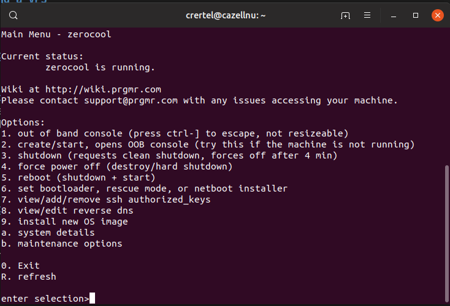
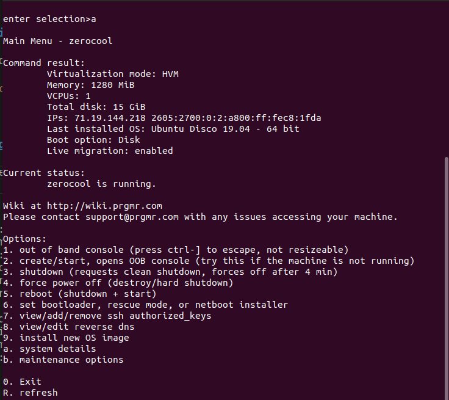
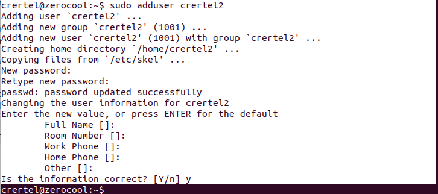

# Setting Up Your Own Server II
## Chris Ertel 2019-06-03

---

## What we'll cover today

* Checking on VPS
* Setting up DNS records
* Setting up user accounts
* Setting up SSH
* Setting up Nginx

---

# Checking on VPS

--

## Connecting to your prgmr instance OOB console

* What is an OOB consoole?
* The **out of band** console
* It's always there for you, even if you screw up SSH.
* Or firewall rules.
* Or keys.

--

## Connecting to your prgmr instance OOB console

```bash
$ ssh -i <your keyfile> <hostname>@<hostanem>.console.xen.prgmr.com
```

--

## Connecting to your prgmr instance OOB console

That should give you a screen that looks like:



--

## Checking the external IP

You can use the system status page to get your external IPs



---

# Setting up DNS records

Go to your domain registrar and setup two records:

* *A record* for `@` at the IP from earlier
* *A record* for `www` at the IP from earlier

---

# Setting up user accounts

You can't be root all the time! We need to:

* Create a normal user
* Add that user to sudoers
* Remove root password login

-- 

## Creating your own user

```bash
# adduser <username>
```

--

## Creating your own user



--

## Adding user to sudoers

```
$ usermod -aG sudo <username>
```

--

## Test that the user can sudo!

**VERY IMPORTANT.**

--

## Remove root login password

```bash
$ sudo passwd -dl root
```

---

# Setting up SSH

We want to stop using the (handy but limited) OOB console.

--

## Install SSH daemon

```bash
$ sudo apt-get install ssh
```

--

## Check that SSH is running

```bash
$ sudo service status sshd
```

--

## Remove root logins

Edit `/etc/ssh/sshd_config` to have the line:

```
PermitRootLogin no
```

And then reload SSH:

```
$ sudo service ssh restart
```

--

## Add user authorized keys

Add an authorized keys folder:

```bash
$ touch ~/.ssh/authorized_keys
```

Append to that file your public key.

Ensure the file is usable:

```bash
$ sudo chmod 700 ~/.ssh
```

--

## Install fail2ban

```bash
$ sudo apt-get install fail2ban
```

--

## Configure fail2ban

```bash
$ sudo cp /etc/fail2ban/fail2ban.conf /etc/fail2ban/fail2ban.local
$ sudo cp /etc/fail2ban/jail.conf /etc/fail2ban/jail.local
```

And check `jail.local` for :

```
[sshd]
enabled = true
```

Check f2b is working:

```bash
$ sudo fail2ban-client status
```

---

# Setting up Nginx

We want to serve files now!

--

## Installing nginx

```bash
$ sudo apt-get install nginx
```

--

## Setting up nginx configs

```bash
$ sudo touch /etc/nginx/sites-available/my_site
$ sudo ln -s /etc/nginx/sites-available/my_site /etc/nginx/sites-enabled/my_site
```

--

## Setup the web folders

In your home folder:

```bash
$ mkdir ~/www
$ sudo mkdir -p /srv/www
$ sudo ln -s /home/<username>/www /srv/www/site_name
$ sudo chmod -R 755 /srv/www
$ echo "Hello, world!" >> ~/www/index.html
```

--

## Populate the config

Change the contents of `/etc/nginx/sites-available/my_site` to look like:

```
server {
	root /srv/www/<site_name>;
	index index.html index.htm;

	server_name minor.gripe www.minor.gripe;

	location / {
		try_files $uri $uri/ /index.html;
	}
}
```

--

## Restart nginx

```bash
$ sudo service nginx restart
```
---
